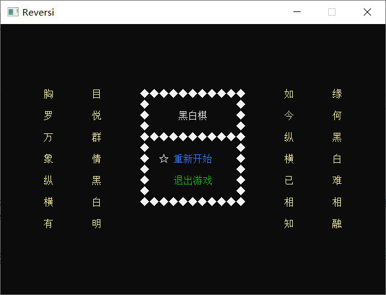
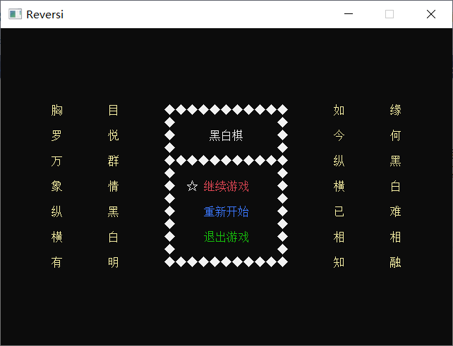
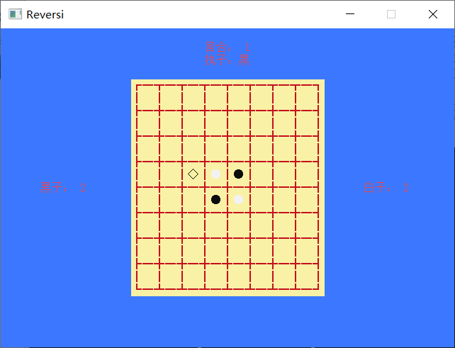

# 黑白棋
又名翻转棋。

## 简介
基于控制台的黑白棋游戏，窗口宽高可以变化，支持中止与继续操作。在棋局界面之时，按<kbd>Escape</kbd>可以中止游戏，此时回到菜单界面，出现继续游戏选项。

## 规则
每落一子，必须转换对手棋子为自己棋子。若无法转换对手棋子，则无子可落，跳过自己回合。

游戏结束条件如下：
1. 双方无子可落
2. 一方无子
3. 棋盘已满

达到其中之一，则游戏结束，棋子数量多者获胜。

## 界面
初始菜单界面如下图所示：  
  
在中止一次游戏之后，菜单增加继续游戏选项，此时菜单界面如下图所示：  
  
棋局界面布局如下图所示：  

## 说明
菜单界面的按键与作用如下表所示：

按键|作用
-|-
<kbd>Enter</kbd>|确定选项
<kbd>Space</kbd>|确定选项
<kbd>↑</kbd>|向上切换选项
<kbd>↓</kbd>|向下切换选项

棋局界面的按键与作用如下表所示：

按键|作用
-|-
<kbd>Escape</kbd>|中止对弈
<kbd>Space</kbd>|确定落子
<kbd>↑</kbd>|上移光标
<kbd>↓</kbd>|下移光标
<kbd>←</kbd>|左移光标
<kbd>→</kbd>|右移光标

## 问题
此游戏在Windows 7和Windows 8之上运行无异常，而在Windows 10之上棋局界面会有问题。  
解决方法：
* 右击控制台的标题栏，弹出右键菜单，选择属性，出现属性选项卡，切换至选项，勾选使用旧版控制台(需要重新启动，影响所有控制台)，点击确定，重新运行程序即可。

## 结构
* bin：可执行程序文件夹
* image：游戏截图文件夹
* src：源码文件夹

## 项目
文件|说明
-|-
[Reversi.hpp](src/Reversi.hpp)|定义键值宏和命名空间宏
[main.cpp](src/main.cpp)|初始游戏
[Renderer.hpp](src/Renderer.hpp)、[Renderer.cpp](src/Renderer.cpp)|定义渲染器类
[Game.hpp](src/Game.hpp)、[Game.cpp](src/Game.cpp)|定义游戏类
[Menu.hpp](src/Menu.hpp)、[Menu.cpp](src/Menu.cpp)|定义菜单类
[Chessboard.hpp](src/Chessboard.hpp)、[Chessboard.cpp](src/Chessboard.cpp)|定义棋局类

## 作者
name：许聪  
mailbox：2592419242@qq.com  
CSDN：https://blog.csdn.net/xucongyoushan  
gitee：https://gitee.com/solifree  
github：https://github.com/xucongandxuchong
